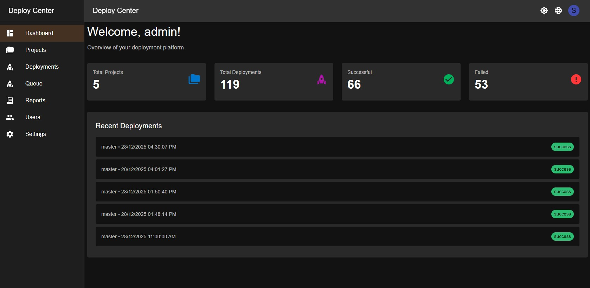
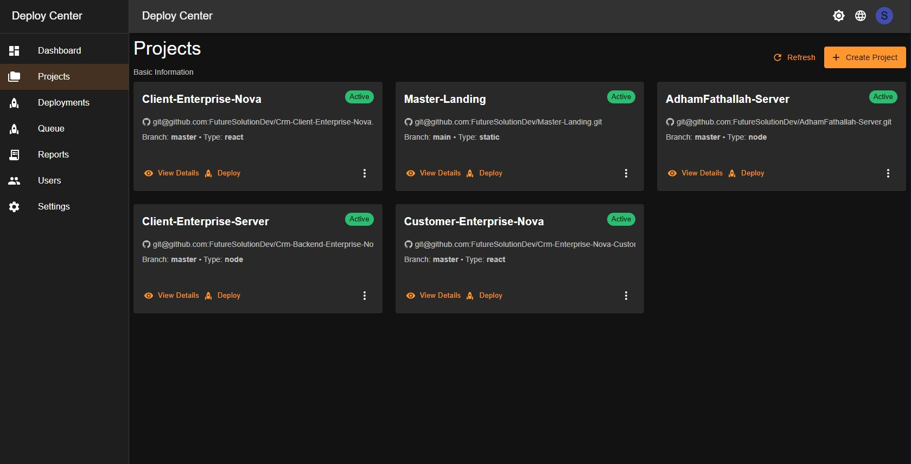
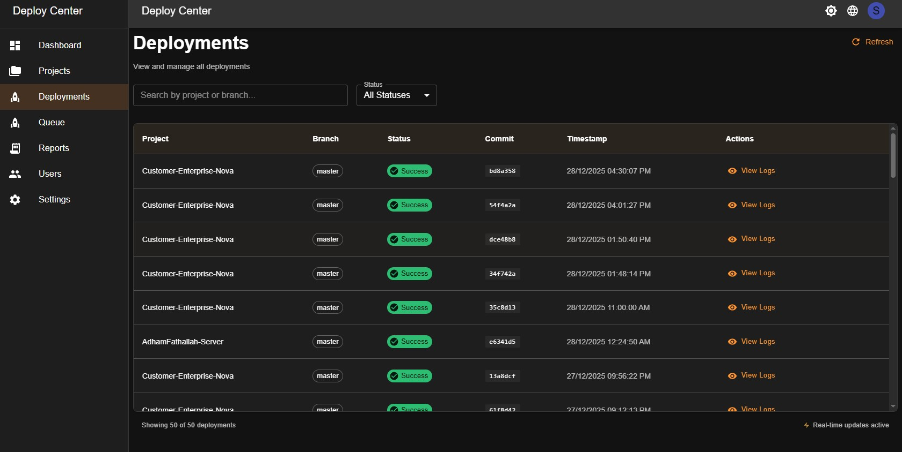
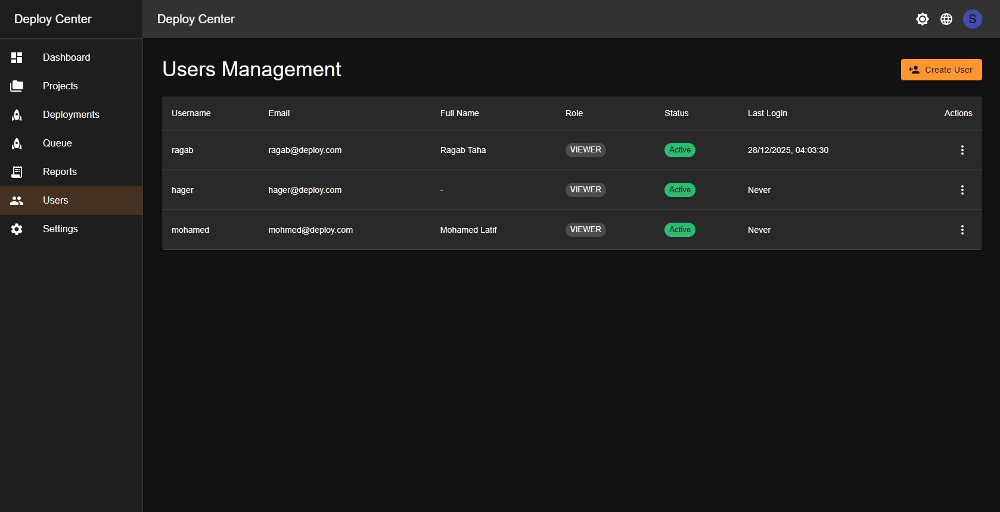

# 🚀 Deploy Center

<div align="center">

[](https://github.com/FutureSolutionDev/Deploy-Center-Server/releases)
[](https://nodejs.org)
[](./LICENSE)
[](https://www.typescriptlang.org/)
[](https://react.dev/)
[](https://github.com/FutureSolutionDev/Deploy-Center-Server/actions)
[](./CONTRIBUTING.md)
[](https://github.com/FutureSolutionDev/Deploy-Center-Server)
[](https://github.com/FutureSolutionDev/Deploy-Center-Server/issues)
[](https://github.com/FutureSolutionDev/Deploy-Center-Server/stargazers)

**A Modern, Secure, and Scalable Self-Hosted CI/CD Deployment Platform**

[Features](#key-features) • [Quick Start](#quick-start) • [Documentation](#documentation) • [Architecture](#architecture) • [Contributing](#contributing)

</div>

---

## 📋 Table of Contents

- [Overview](#overview)
- [Key Features](#key-features)
- [What Problems Does It Solve?](#what-problems-does-it-solve)
- [Architecture](#architecture)
- [Technology Stack](#technology-stack)
- [Quick Start](#quick-start)
- [Installation](#installation)
- [Configuration](#configuration)
- [Documentation](#documentation)
- [Security](#security)
- [RBAC System](#rbac)
- [Project Structure](#project-structure)
- [Roadmap](#roadmap)
- [Contributing](#contributing)
- [Support](#support)
- [License](#license)

---

<div id="overview"></div>

## 🎯 Overview

**Deploy Center** is a comprehensive, self-hosted CI/CD deployment platform designed to automate and streamline your deployment workflows. Built with modern technologies and security best practices, it provides enterprise-grade features while remaining simple to use and maintain.

### Why Deploy Center?

- **🔒 Self-Hosted**: Full control over your data and infrastructure
- **🎨 Modern UI**: Beautiful, responsive React dashboard
- **🔐 Enterprise Security**: Role-Based Access Control (RBAC), JWT authentication, SSH key management
- **📊 Real-Time Monitoring**: Live deployment status, queue management, and notifications
- **🚀 Easy Setup**: Quick installation and configuration
- **📱 Notifications**: Discord, Slack, and custom webhook integrations
- **🔄 Auto Recovery**: Automatic failure detection and rollback capabilities
- **📈 Scalable**: Designed to handle multiple projects and teams

---
<div id="key-features"></div>

## ✨ Key Features

### 🔐 **Security & Authentication**

- **Multi-Layer Authentication**
  - JWT-based access & refresh tokens
  - Secure session management
  - Password encryption with bcrypt
  - API key authentication for external integrations

- **Role-Based Access Control (RBAC)**
  - 4 user roles: Admin, Manager, Developer, Viewer
  - Granular permissions system
  - Project-level access control
  - Feature-based authorization

- **SSH Key Management**
  - Automated SSH key generation (ED25519/RSA)
  - Encrypted private key storage (AES-256-GCM)
  - Key rotation and lifecycle management
  - GitHub Deploy Keys integration

### 🚀 **Deployment Features**

- **Intelligent Deployment Pipeline**
  - Customizable multi-step pipelines
  - Conditional step execution
  - Variable substitution system
  - Pre/post deployment hooks

- **Multiple Trigger Types**
  - GitHub webhook integration
  - Manual deployment triggers
  - Scheduled deployments (coming soon)
  - API-triggered deployments

- **Queue Management**
  - Per-project deployment queues
  - Automatic queue processing
  - Priority-based execution
  - Queue cancellation and retry

- **Real-Time Monitoring**
  - Live deployment status via WebSocket
  - Detailed step-by-step logs
  - Deployment history tracking
  - Performance metrics and analytics

### 📊 **Project Management**

- **Multi-Project Support**
  - Unlimited projects
  - Project-specific configurations
  - Independent deployment pipelines
  - Project archiving and activation

- **Project Members**
  - Team collaboration features
  - Member role assignment (Owner/Member)
  - Access control per project
  - Audit trail for member changes

- **Configuration Management**
  - JSON-based configuration
  - Environment variables support
  - Secrets management
  - Configuration versioning

### 📈 **Monitoring & Analytics**

- **Dashboard**
  - Overview of all projects
  - Deployment statistics
  - Success/failure rates
  - Recent activity feed

- **Project Statistics**
  - Total deployments count
  - Success rate percentage
  - Average deployment duration
  - Deployment timeline graphs

- **Audit Logging**
  - Complete activity tracking
  - User action logs
  - Project modification history
  - Security event logging

### 🔔 **Notifications**

- **Multi-Channel Support**
  - Discord webhooks
  - Slack integration (coming soon)
  - Email notifications (coming soon)
  - Custom webhook endpoints

- **Smart Notifications**
  - Deployment status updates
  - Error notifications
  - Success confirmations
  - Queue status changes

### 🛠️ **Developer Experience**

- **Modern Tech Stack**
  - TypeScript for type safety
  - React 19 with modern hooks
  - Material-UI components
  - Socket.IO for real-time updates

- **Developer Tools**
  - Comprehensive API documentation
  - Postman collection
  - CLI tools (coming soon)
  - SDK for integrations (coming soon)

- **Code Quality**
  - ESLint configuration
  - Prettier formatting
  - TypeScript strict mode
  - Automated testing (in progress)

---
<div id="what-problems-does-it-solve"></div>

## 💡 What Problems Does It Solve?

### 1. **Manual Deployment Complexity**

**Problem**: Manually deploying applications is time-consuming, error-prone, and doesn't scale.

**Solution**: Deploy Center automates the entire deployment process with customizable pipelines, reducing deployment time from hours to minutes.

### 2. **Lack of Deployment Visibility**

**Problem**: Teams don't know who deployed what, when, or why deployments failed.

**Solution**: Complete audit trails, real-time monitoring, and detailed logs provide full transparency into every deployment.

### 3. **Security Concerns**

**Problem**: Shared credentials and SSH keys create security vulnerabilities.

**Solution**: Encrypted SSH key storage, RBAC, and project-level access control ensure secure deployments.

### 4. **Team Collaboration Issues**

**Problem**: Multiple developers can't safely deploy to the same project simultaneously.

**Solution**: Intelligent queue system prevents conflicts and ensures deployments run in the correct order.

### 5. **No Central Control**

**Problem**: Deployments scattered across different tools and scripts make management difficult.

**Solution**: Centralized platform for all deployments with unified configuration and monitoring.

### 6. **Failed Deployment Recovery**

**Problem**: When deployments fail, recovering the previous state is manual and risky.

**Solution**: Automatic failure detection, rollback capabilities, and deployment history for easy recovery.

### 7. **Access Control Limitations**

**Problem**: All team members have the same access level, creating security risks.

**Solution**: Granular RBAC system with 4 roles and project-level permissions.

### 8. **Notification Gaps**

**Problem**: Teams aren't notified when deployments fail or succeed.

**Solution**: Multi-channel notifications (Discord, Slack) keep teams informed in real-time.

---

<div id="architecture"></div>

## 🏗️ Architecture

Deploy Center follows a modern three-tier architecture:

```ascii
┌─────────────────────────────────────────────────────────────┐
│                    Frontend (React SPA)                     │
│  ┌──────────────┐  ┌──────────────┐  ┌──────────────┐     │
│  │  Dashboard   │  │  Projects    │  │  Settings    │     │
│  └──────────────┘  └──────────────┘  └──────────────┘     │
│  ┌──────────────┐  ┌──────────────┐  ┌──────────────┐     │
│  │ Deployments  │  │    Queue     │  │    Users     │     │
│  └──────────────┘  └──────────────┘  └──────────────┘     │
└─────────────────────────────────────────────────────────────┘
                            │
                    WebSocket + REST API
                            │
┌─────────────────────────────────────────────────────────────┐
│              Backend (Node.js + Express)                    │
│  ┌──────────────┐  ┌──────────────┐  ┌──────────────┐     │
│  │     Auth     │  │   Projects   │  │ Deployments  │     │
│  │   Service    │  │   Service    │  │   Service    │     │
│  └──────────────┘  └──────────────┘  └──────────────┘     │
│  ┌──────────────┐  ┌──────────────┐  ┌──────────────┐     │
│  │    Queue     │  │   Pipeline   │  │Notification  │     │
│  │   Service    │  │   Service    │  │   Service    │     │
│  └──────────────┘  └──────────────┘  └──────────────┘     │
└─────────────────────────────────────────────────────────────┘
                            │
                    Sequelize ORM
                            │
┌─────────────────────────────────────────────────────────────┐
│                  Database (MySQL/MariaDB)                   │
│  ┌──────────┐  ┌──────────┐  ┌──────────┐  ┌──────────┐  │
│  │  Users   │  │ Projects │  │Deployments│ │ Sessions │  │
│  └──────────┘  └──────────┘  └──────────┘  └──────────┘  │
│  ┌──────────┐  ┌──────────┐  ┌──────────┐  ┌──────────┐  │
│  │ ApiKeys  │  │ Members  │  │AuditLogs │  │ Settings │  │
│  └──────────┘  └──────────┘  └──────────┘  └──────────┘  │
└─────────────────────────────────────────────────────────────┘
```

<div id="key-components"></div>

### Key Components

1. **Frontend Layer**
   - React 19 + TypeScript
   - Material-UI (MUI) components
   - React Query for data fetching
   - Socket.IO client for real-time updates

2. **Backend Layer**
   - Express.js server
   - Service-oriented architecture
   - JWT authentication middleware
   - WebSocket server

3. **Data Layer**
   - MySQL/MariaDB database
   - Sequelize ORM
   - Automated migrations
   - Connection pooling

4. **External Integrations**
   - GitHub webhooks
   - Discord notifications
   - SSH Git operations

---

<div id="technology-stack"></div>

## 🛠️ Technology Stack

### Backend

- **Runtime**: Node.js 18+
- **Framework**: Express.js
- **Language**: TypeScript 5.7
- **ORM**: Sequelize 6.37
- **Database**: MySQL 8.0 / MariaDB 11.2
- **Authentication**: JWT (jsonwebtoken)
- **Encryption**: bcryptjs, crypto (AES-256-GCM)
- **Real-time**: Socket.IO 4.8
- **Process Manager**: PM2
- **Logging**: Winston
- **Validation**: express-validator

### Frontend

- **Framework**: React 19
- **Language**: TypeScript 5.6
- **UI Library**: Material-UI (MUI) 7.5
- **State Management**: React Query (TanStack Query)
- **Routing**: React Router 7.6
- **Charts**: Recharts 2.15
- **HTTP Client**: Axios
- **Build Tool**: Vite 7.2

### DevOps & Tools

- **Version Control**: Git
- **Package Manager**: npm
- **Code Quality**: ESLint, Prettier
- **Security Scanning**: CodeQL, npm audit
- **CI/CD**: GitHub Actions
- **Container**: Docker (optional)

---

<div id="quick-start"></div>

## 🚀 Quick Start

### Prerequisites

- Node.js >= 18.0.0
- MySQL >= 8.0 or MariaDB >= 11.2
- Git
- PM2 (for production)

### Installation

```bash
# Clone the repository
git clone https://github.com/FutureSolutionDev/Deploy-Center-Server.git
cd Deploy-Center-Server

# Install backend dependencies
cd server
npm install

# Install frontend dependencies
cd ../client
npm install
```

### Configuration

1. **Backend Configuration** (`server/.env`)

```env
# Server
NODE_ENV=production
PORT=9090

# Database
DB_HOST=localhost
DB_PORT=3306
DB_NAME=deploy_center
DB_USER=your_db_user
DB_PASSWORD=your_db_password

# JWT Secrets (generate strong random strings)
JWT_ACCESS_SECRET=your_access_secret_here
JWT_REFRESH_SECRET=your_refresh_secret_here

# Encryption Key (32-byte hex string)
ENCRYPTION_KEY=your_64_character_hex_string_here

# Default Admin (created on first run)
DEFAULT_ADMIN_USERNAME=admin
DEFAULT_ADMIN_EMAIL=admin@example.com
DEFAULT_ADMIN_PASSWORD=change_me_immediately

# Optional: Discord Webhook
DISCORD_WEBHOOK_URL=https://discord.com/api/webhooks/...
```

2. **Generate Encryption Key**

```bash
node -e "console.log(require('crypto').randomBytes(32).toString('hex'))"
```

### Database Setup

```bash
cd server

# Run migrations
npm run migrate

# Or let the server create tables automatically on first run
npm run dev
```

### Running the Application

**Development:**

```bash
# Terminal 1 - Backend
cd server
npm run dev

# Terminal 2 - Frontend
cd client
npm run dev
```

**Production:**

```bash
# Build frontend
cd client
npm run build

# Start backend with PM2
cd ../server
pm2 start ecosystem.config.js --env production
```

Access the application at `http://localhost:9090`

Default credentials:

- Username: `admin`
- Password: `change_me_immediately` (change this!)

---

<div id="documentation"></div>

## 📚 Documentation

### Core Documentation

- [API Documentation](./docs/API_DOCUMENTATION.md) - Complete API reference
- [FEATURES_TODO.md](./docs/FEATURES_TODO.md) - Feature tracking and roadmap
- [VISION.md](./docs/VISION.md) - Future vision and development plans

### Development Guides

- [Coding Standards](./docs/CODING_STANDARDS.md) - Code style and best practices

### User Guides

- [Creating Projects](./docs/guides/creating-projects.md) - Complete guide to setting up your first project
- [Deployment Workflows](./docs/guides/deployment-workflows.md) - Understanding the deployment process ( Soon )
- [Pipeline Configuration](./docs/guides/pipeline-configuration.md) - Advanced pipeline setup ( Soon )
- [SSH Key Management](./docs/guides/ssh-keys.md) - Working with private repositories ( Soon )
- [Webhook Setup](./docs/guides/webhooks.md) - Configuring GitHub/GitLab webhooks ( Soon )
- [Environment Variables](./docs/guides/environment-variables.md) - Managing variables ( Soon )
- [Notifications Setup](./docs/guides/notifications.md) - Configuring notification channels ( Soon )

### Additional Resources

- [FAQ](./docs/FAQ.md) - Frequently asked questions
- [Open Source Package](./docs/OPEN_SOURCE_RELEASE_PACKAGE.md) - Release preparation

---

<div id="rbac"></div>

## 🔐 RBAC (Role-Based Access Control)

Deploy Center implements a comprehensive 4-tier role system:

### Role Hierarchy

```ascii
┌─────────────────────────────────────────────────────┐
│ Admin                                               │
│ • Full system access                                │
│ • User management                                   │
│ • All projects (create, edit, delete, deploy)      │
│ • System settings                                   │
└─────────────────────────────────────────────────────┘
                         │
                         ▼
┌─────────────────────────────────────────────────────┐
│ Manager                                             │
│ • User management (create, edit users)             │
│ • All projects (create, edit, delete, deploy)      │
│ • Cannot modify system settings                     │
└─────────────────────────────────────────────────────┘
                         │
                         ▼
┌─────────────────────────────────────────────────────┐
│ Developer                                           │
│ • Assigned projects only (edit, deploy)            │
│ • Cannot create/delete projects                     │
│ • Cannot manage users                               │
│ • Cannot access system settings                     │
└─────────────────────────────────────────────────────┘
                         │
                         ▼
┌─────────────────────────────────────────────────────┐
│ Viewer                                              │
│ • Read-only access to assigned projects            │
│ • View deployments and logs                         │
│ • Cannot trigger deployments                        │
│ • Cannot modify anything                            │
└─────────────────────────────────────────────────────┘
```

### Permission Matrix

| Feature | Admin | Manager | Developer | Viewer |
|---------|-------|---------|-----------|--------|
| View Dashboard | ✅ | ✅ | ✅ | ✅ |
| View All Projects | ✅ | ✅ | ❌ | ❌ |
| View Assigned Projects | ✅ | ✅ | ✅ | ✅ |
| Create Project | ✅ | ✅ | ❌ | ❌ |
| Edit Project | ✅ | ✅ | ✅* | ❌ |
| Delete Project | ✅ | ✅ | ❌ | ❌ |
| Deploy Project | ✅ | ✅ | ✅* | ❌ |
| View Deployments | ✅ | ✅ | ✅* | ✅* |
| View Deployment Logs | ✅ | ✅ | ✅* | ✅* |
| Cancel Deployment | ✅ | ✅ | ✅* | ❌ |
| Retry Deployment | ✅ | ✅ | ✅* | ❌ |
| View Queue | ✅ | ✅ | ✅* | ✅* |
| Manage Queue | ✅ | ✅ | ✅* | ❌ |
| Manage Users | ✅ | ✅ | ❌ | ❌ |
| Manage Project Members | ✅ | ✅ | ❌ | ❌ |
| View Sensitive Data | ✅ | ✅ | ❌ | ❌ |
| Manage API Keys | ✅ | ✅ | ❌ | ❌ |
| System Settings | ✅ | ❌ | ❌ | ❌ |

*Only for assigned projects

### Project-Level Access

Projects support two member roles:

- **Owner**: Can manage project members (future feature)
- **Member**: Regular project access based on user role

---

<div id="project-structure"></div>

## 📁 Project Structure

```tree
deploy-center/
├── client/                    # Frontend React application
│   ├── src/
│   │   ├── components/       # Reusable React components
│   │   ├── contexts/         # React contexts (Auth, Theme, etc.)
│   │   ├── hooks/           # Custom React hooks
│   │   ├── pages/           # Page components
│   │   ├── services/        # API service layer
│   │   ├── types/           # TypeScript type definitions
│   │   └── utils/           # Utility functions
│   ├── public/              # Static assets
│   └── package.json
│
├── server/                   # Backend Node.js application
│   ├── src/
│   │   ├── Controllers/     # Route controllers
│   │   ├── Services/        # Business logic services
│   │   ├── Models/          # Sequelize models
│   │   ├── Middlewares/     # Express middlewares
│   │   ├── Routes/          # API routes
│   │   ├── Utils/           # Utility functions
│   │   ├── Types/           # TypeScript type definitions
│   │   ├── Migrations/      # Database migrations
│   │   └── index.ts         # Application entry point
│   ├── .github/
│   │   └── workflows/       # GitHub Actions workflows
│   ├── public/              # Built frontend files
│   ├── logs/                # Application logs
│   └── package.json
│
├── CLAUDE.md                # Project documentation for Claude AI
├── README.md                # This file
├── VISION.md                # Future roadmap and vision
├── FEATURES_TODO.md         # Feature tracking
├── API_DOCUMENTATION.md     # API reference
└── *.md                     # Other documentation files
```

---

<div id="security"></div>

## 🔒 Security

Deploy Center implements multiple layers of security:

### Authentication

- JWT-based token authentication
- 2FA Authentication
- Secure refresh token rotation
- Configurable token expiration
- Session management

### Data Protection

- AES-256-GCM encryption for sensitive data
- bcrypt password hashing (10 rounds)
- Encrypted SSH private keys
- Secure environment variable handling

### API Security

- CORS configuration
- Rate limiting (coming soon)
- Input validation and sanitization
- SQL injection prevention (Sequelize ORM)
- XSS protection

### Access Control

- Role-Based Access Control (RBAC)
- Project-level permissions
- API key authentication
- Audit logging

### GitHub Security Workflows

- CodeQL security analysis
- Dependency vulnerability scanning
- Automated security updates
- Code quality checks

---

<div id="screenshots"></div>

## 🎨 Screenshots

### Dashboard



### Projects Management



### Deployment Monitoring



### RBAC & User Management



---

<div id="contributing"></div>

## 🤝 Contributing

We welcome contributions! Please see our [Contributing Guide](./CONTRIBUTING.md) for details.

### Development Workflow

1. Fork the repository
2. Create a feature branch (`git checkout -b feature/amazing-feature`)
3. Make your changes
4. Run tests (`npm test`)
5. Commit your changes (`git commit -m 'Add amazing feature'`)
6. Push to the branch (`git push origin feature/amazing-feature`)
7. Open a Pull Request

### Code Style

- Follow the [Coding Standards](./CODING_STANDARDS.md)
- Use TypeScript strict mode
- Write meaningful commit messages
- Add tests for new features

---

<div id="roadmap"></div>

## 📊 Roadmap

See [VISION.md](./docs/VISION.md) and [FEATURES_TODO.md](./docs/FEATURES_TODO.md) for detailed roadmap.

### Coming Soon (Q4 2025 - Q1 2026)

- ✅ Complete RBAC implementation
- ✅ Project member management
- 🔄 Docker support
- 🔄 Slack notifications
- 🔄 Email notifications
- 🔄 Deployment rollback UI

### Planned (Q2 2026)

- Multi-server deployment support
- Kubernetes integration
- Advanced analytics dashboard
- CLI tool
- Mobile app (React Native)

---

<div id="license"></div>

## 📄 License

This project is licensed under the MIT License - see the [LICENSE](./LICENSE.md) file for details.

---

## 🙏 Acknowledgments

- [Express.js](https://expressjs.com/) - Web framework
- [React](https://react.dev/) - UI library
- [Material-UI](https://mui.com/) - Component library
- [Sequelize](https://sequelize.org/) - ORM
- [Socket.IO](https://socket.io/) - Real-time communication
- All our [contributors](./docs/CONTRIBUTORS.md)

---

<div id="support"></div>

## 📞 Support

- 📧 Email: <support@futuresolutionsdev.com>
- 💬 Discord: [Join our server](https://discord.gg/j8edhTZy)
- 🐛 Issues: [GitHub Issues](https://github.com/FutureSolutionDev/Deploy-Center-Server/issues)
- 📖 Documentation ( Coming Soon): [Wiki](https://github.com/FutureSolutionDev/Deploy-Center-Server/wiki)

---

<div align="center">

Made with ❤️ by the Deploy Center Team

[⬆ Back to Top](#-deploy-center)

</div>
