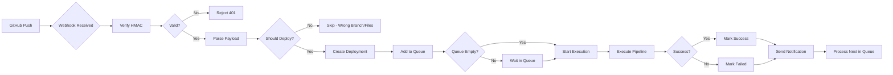
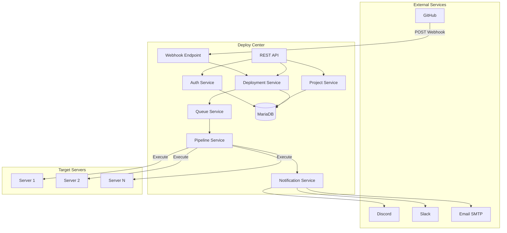
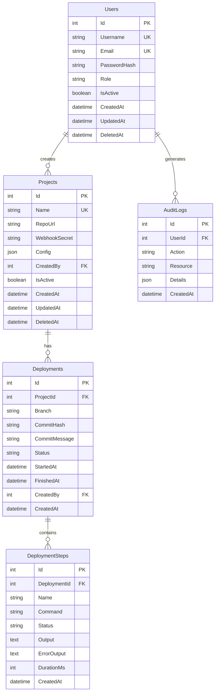

<div align="center">

# 🚀 Deploy Center

### **Modern Self-Hosted CI/CD Deployment Platform**

[-blue.svg)](./LICENSES/)
[](https://www.typescriptlang.org/)
[](https://nodejs.org/)
[](https://expressjs.com/)
[](https://mariadb.org/)
[](https://github.com/FutureSolutionDev/Deploy-Center-Server/issues)
[](https://github.com/FutureSolutionDev/Deploy-Center-Server/stargazers)
[](./CONTRIBUTING.md)
[](./docs/PROJECT_STRUCTURE.md)
[](./SECURITY.md)

**Deploy Center** is an enterprise-grade, self-hosted CI/CD automation platform that transforms GitHub webhooks into intelligent deployment pipelines. Built from the ground up with TypeScript, SOLID principles, and production-ready architecture.

[**Quick Start**](./docs/QUICK_START.md) • [**Documentation**](./docs/) • [**API Reference**](#-api-endpoints) • [**Contributing**](./CONTRIBUTING.md) • [**Roadmap**](#-roadmap)


</div>

---

## 📑 **Table of Contents**

- [Why Deploy Center?](#-why-deploy-center)
- [Key Features](#-key-features)
- [Architecture](#-architecture)
- [Prerequisites](#-prerequisites)
- [Quick Start](#-quick-start)
- [Installation](#-installation)
- [Configuration](#-configuration)
- [API Endpoints](#-api-endpoints)
- [Pipeline Configuration](#-pipeline-configuration)
- [Webhook Setup](#-webhook-setup)
- [Notifications](#-notifications)
- [Deployment Workflow](#-deployment-workflow)
- [Security](#-security)
- [Testing with Postman](#-testing-with-postman)
- [Production Deployment](#-production-deployment)
- [Monitoring & Logging](#-monitoring--logging)
- [Troubleshooting](#-troubleshooting)
- [Architecture Diagrams](#-architecture-diagrams)
- [Project Structure](#-project-structure)
- [Roadmap](#-roadmap)
- [Contributing](#-contributing)
- [License](#-license)
- [Support](#-support)
- [Maintainers](#-maintainers)

---

## 🎯 **Why Deploy Center?**

Traditional CI/CD platforms are either **too complex** (Jenkins, GitLab CI), **too expensive** (CircleCI, Travis CI), or **too limited** (basic webhook handlers). Deploy Center strikes the perfect balance:

### **🏆 What Makes Us Different**

| Feature | Deploy Center | Traditional Platforms | Basic Webhooks |
|---------|--------------|----------------------|----------------|
| **Self-Hosted** | ✅ Full control | ⚠️ Limited options | ✅ Yes |
| **Easy Setup** | ✅ <5 minutes | ❌ Hours/days | ✅ Minutes |
| **Web Dashboard** | ✅ Beautiful UI | ✅ Complex | ❌ No interface |
| **Multi-Project** | ✅ Unlimited | ✅ Yes (paid) | ⚠️ Manual setup |
| **Queue Management** | ✅ Built-in | ✅ Yes | ❌ None |
| **Role-Based Access** | ✅ Admin/Dev/Viewer | ✅ Complex RBAC | ❌ None |
| **Notifications** | ✅ Discord, Slack, Email, Telegram | ✅ Limited | ⚠️ Manual |
| **Pipeline as Code** | ✅ JSON Config | ⚠️ YAML (complex) | ❌ Scripts only |
| **Real-time Monitoring** | ✅ Live updates | ✅ Yes | ❌ Logs only |
| **Free & Open** | ✅ Dual license | ❌ Paid tiers | ✅ DIY |

### **💡 Perfect For**

- 🚀 **Startups** — Self-hosted, free, powerful
- 🏢 **SMEs** — Multi-team deployment automation
- 👨‍💻 **Developers** — Personal projects and portfolios
- 🎓 **Learning** — Study production-grade TypeScript architecture
- 🏭 **Agencies** — Manage client deployments centrally

---

## ✨ **Key Features**

### **🔐 Authentication & Authorization**

- JWT-based authentication with refresh tokens
- Role-based access control (Admin, Developer, Viewer)
- Secure password hashing with bcrypt (12 rounds)
- Automatic admin recovery system
- Cookie-based session management

### **📦 Project Management**

- Unlimited project support
- GitHub webhook integration
- Automatic deployment on push
- Path-based deployment triggers (deploy only when specific files change)
- Project-level statistics and analytics
- Webhook secret management and regeneration

### **⚙️ Smart Deployment Pipeline**

- Custom multi-step pipeline configuration
- Variable substitution system (`{{variable}}`)
- Conditional step execution (`RunIf` conditions)
- Per-step timeout configuration
- Continue-on-error support
- Working directory control
- Command output capture and storage
- Execution duration tracking

### **🚦 Queue Management**

- Prevents concurrent deployments per project
- Priority-based queue (manual > auto)
- Project-specific queues
- Queue status monitoring
- Bulk queue operations (cancel all pending)
- Event-driven queue processing

### **🔔 Multi-Platform Notifications**

- **Discord** — Rich embeds with color-coded status
- **Slack** — Formatted message attachments
- **Email** — HTML email templates with SMTP
- **Telegram** — Markdown-formatted messages
- Per-project notification configuration
- Deployment success/failure alerts

### **📊 Comprehensive Logging**

- Winston logger with daily rotation
- Structured logging with metadata
- Separate log files (combined, error, deployment)
- Real-time log streaming
- Log retention policies

### **🛡️ Enterprise Security**

- Helmet.js security headers
- CORS configuration
- Rate limiting (per-endpoint customization)
- Input validation with Joi schemas
- AES-256-GCM encryption for sensitive data
- HMAC webhook signature verification
- SQL injection prevention (Sequelize ORM)
- XSS protection
- CSRF protection ready

### **🎯 Developer Experience**

- Complete REST API (30+ endpoints)
- Postman collection included
- TypeScript with strict mode
- Hot reload development
- ESLint + Prettier
- Comprehensive error messages
- Health check endpoint

---

## 🏗️ **Architecture**

Deploy Center follows a **clean layered architecture** pattern with SOLID principles:

```ascii
┌──────────────────────────────────────────────────────┐
│                 GitHub Webhook                       │
│            (Push/PR/Release Events)                  │
└────────────────────┬─────────────────────────────────┘
                     │
           ┌─────────▼─────────┐
           │  Webhook Routes   │
           │   + Validation    │
           └─────────┬─────────┘
                     │
           ┌─────────▼─────────┐
           │  WebhookService   │
           │  • Verify HMAC    │
           │  • Parse Payload  │
           └─────────┬─────────┘
                     │
           ┌─────────▼─────────┐
           │ DeploymentService │
           │  Create Record    │
           └─────────┬─────────┘
                     │
           ┌─────────▼─────────┐
           │   Queue Service   │
           │  (Singleton)      │
           └─────────┬─────────┘
                     │
           ┌─────────▼─────────┐
           │ PipelineService   │
           │  Execute Steps    │
           └─────────┬─────────┘
                     │
      ┌──────────────┴──────────────┐
      │                             │
┌─────▼──────┐            ┌─────────▼────────┐
│ Git Pull   │            │ NotificationSvc  │
│ npm install│            │  Discord/Slack   │
│ npm build  │            │  Email/Telegram  │
│ PM2 restart│            └──────────────────┘
└────────────┘
```

### **Layer Breakdown**

```ascii
┌────────────────────────────────────────┐
│            Routes Layer                │  ← URL Mapping
├────────────────────────────────────────┤
│         Controllers Layer              │  ← Request/Response
├────────────────────────────────────────┤
│          Services Layer                │  ← Business Logic
├────────────────────────────────────────┤
│          Models Layer                  │  ← Data Access (ORM)
├────────────────────────────────────────┤
│      Database Layer (MariaDB)          │  ← Persistence
└────────────────────────────────────────┘
```

### **Design Patterns**

- ✅ **Singleton** — Config, Logger, Queue, Database
- ✅ **Repository** — Data access abstraction
- ✅ **Service Layer** — Business logic isolation
- ✅ **Factory** — Response formatting, middleware creation
- ✅ **Dependency Injection** — Loose coupling

**[📖 View Detailed Architecture](./docs/PROJECT_STRUCTURE.md)**

---

## 📋 **Prerequisites**

### **Required**

- **Node.js** ≥ 18.0.0
- **npm** ≥ 9.0.0
- **MariaDB** ≥ 10.6 (or MySQL ≥ 8.0)
- **Git** ≥ 2.0

### **Recommended**

- **PM2** — Process manager for production
- **Nginx** — Reverse proxy
- **SSL Certificate** — For webhook HTTPS

### **Quick Version Check**

```bash
node --version   # Should show v18.0.0+
npm --version    # Should show 9.0.0+
mysql --version  # Should show MariaDB 10.6+ or MySQL 8.0+
git --version    # Should show 2.0+
```

---

## ⚡ **Quick Start**

Get up and running in **5 minutes**:

### **1. Clone Repository**

```bash
git clone https://github.com/FutureSolutionDev/Deploy-Center-Server.git
cd Deploy-Center-Server/server
```

### **2. Install Dependencies**

```bash
npm install
```

### **3. Setup Database**

```sql
CREATE DATABASE deploy_center CHARACTER SET utf8mb4 COLLATE utf8mb4_unicode_ci;
CREATE USER 'deploy_user'@'localhost' IDENTIFIED BY 'your_password';
GRANT ALL PRIVILEGES ON deploy_center.* TO 'deploy_user'@'localhost';
FLUSH PRIVILEGES;
```

### **4. Configure Environment**

```bash
cp .env.example .env
# Edit .env with your settings (database, JWT secrets, etc.)
```

### **5. Start Development Server**

```bash
npm run dev
```

Server starts at `http://localhost:3000` 🎉

### **6. Create Admin User**

```bash
curl -X POST http://localhost:3000/api/auth/register \
  -H "Content-Type: application/json" \
  -d '{
    "Username": "admin",
    "Email": "admin@example.com",
    "Password": "Admin@12345",
    "Role": "admin"
  }'
```

**[📖 Detailed Installation Guide](./docs/INSTALLATION.md)**

---

## 🛠️ **Installation**

For production setup, Docker deployment, PM2 configuration, and SSL setup:

**[📖 Complete Installation Guide](./docs/INSTALLATION.md)**

Covers:

- System requirements
- Step-by-step installation (Linux/macOS/Windows)
- Database setup and configuration
- Environment variable reference
- Production deployment with PM2
- Nginx reverse proxy setup
- SSL certificate with Let's Encrypt
- Docker deployment
- Firewall configuration
- Backup automation

---

## ⚙️ **Configuration**

### **Environment Variables**

Create `.env` from `.env.example`:

```env
# Server
NODE_ENV=development
PORT=3000

# Database
DB_HOST=localhost
DB_PORT=3306
DB_NAME=deploy_center
DB_USER=deploy_user
DB_PASSWORD=your_secure_password
DB_DIALECT=mariadb
DB_AUTO_MIGRATE=true

# Default Admin (auto-created on first run)
DEFAULT_ADMIN_USERNAME=admin
DEFAULT_ADMIN_EMAIL=admin@example.com
DEFAULT_ADMIN_PASSWORD=changeme

# JWT
JWT_SECRET=your-super-secret-jwt-key-change-this
JWT_EXPIRY=1h
JWT_REFRESH_SECRET=your-super-secret-refresh-key
JWT_REFRESH_EXPIRY=7d

# Encryption (32 characters)
ENCRYPTION_KEY=your-32-character-encryption-key

# CORS (comma-separated)
CORS_ORIGINS=http://localhost:3000,http://localhost:5173

# Paths
DEPLOYMENTS_PATH=./deployments
LOGS_PATH=./logs
```

### **Generate Secure Secrets**

```bash
# Generate JWT secret
node -e "console.log(require('crypto').randomBytes(64).toString('hex'))"

# Generate encryption key (32 bytes)
node -e "console.log(require('crypto').randomBytes(32).toString('hex'))"
```

---

## 📡 **API Endpoints**

### **Authentication**

| Method | Endpoint | Description | Auth Required |
|--------|----------|-------------|---------------|
| `POST` | `/api/auth/register` | Register new user | No |
| `POST` | `/api/auth/login` | Login user | No |
| `POST` | `/api/auth/refresh` | Refresh access token | Yes (Refresh Token) |
| `GET` | `/api/auth/profile` | Get user profile | Yes |
| `POST` | `/api/auth/change-password` | Change password | Yes |

### **Projects**

| Method | Endpoint | Description | Auth Required | Role |
|--------|----------|-------------|---------------|------|
| `GET` | `/api/projects` | List all projects | Yes | All |
| `GET` | `/api/projects/:id` | Get project details | Yes | All |
| `GET` | `/api/projects/name/:name` | Get project by name | Yes | All |
| `POST` | `/api/projects` | Create project | Yes | Admin |
| `PUT` | `/api/projects/:id` | Update project | Yes | Admin |
| `DELETE` | `/api/projects/:id` | Delete project | Yes | Admin |
| `POST` | `/api/projects/:id/regenerate-webhook` | Regenerate webhook secret | Yes | Admin |
| `GET` | `/api/projects/:id/statistics` | Get project statistics | Yes | All |

### **Deployments**

| Method | Endpoint | Description | Auth Required | Role |
|--------|----------|-------------|---------------|------|
| `GET` | `/api/deployments/:id` | Get deployment details | Yes | All |
| `GET` | `/api/deployments/projects/:projectId/deployments` | List project deployments | Yes | All |
| `POST` | `/api/deployments/projects/:projectId/deploy` | Trigger manual deployment | Yes | Developer+ |
| `POST` | `/api/deployments/:id/cancel` | Cancel deployment | Yes | Developer+ |
| `POST` | `/api/deployments/:id/retry` | Retry failed deployment | Yes | Developer+ |
| `GET` | `/api/deployments/statistics` | Get deployment statistics | Yes | All |
| `GET` | `/api/deployments/queue/status` | Get global queue status | Yes | All |
| `GET` | `/api/deployments/projects/:projectId/queue/status` | Get project queue status | Yes | All |
| `POST` | `/api/deployments/projects/:projectId/queue/cancel-all` | Cancel all pending | Yes | Admin |

### **Webhooks**

| Method | Endpoint | Description | Auth Required |
|--------|----------|-------------|---------------|
| `POST` | `/webhook/github/:projectName` | GitHub webhook receiver | No (HMAC) |
| `GET` | `/webhook/test/:projectName` | Test webhook endpoint | No |

### **Health & Info**

| Method | Endpoint | Description |
|--------|----------|-------------|
| `GET` | `/health` | Health check |
| `GET` | `/` | API information |

**[📖 Full API Documentation](./docs/POSTMAN_GUIDE.md)**

---

## 🔧 **Pipeline Configuration**

### **Basic Pipeline Example**

```json
{
  "Name": "my-app",
  "RepoUrl": "https://github.com/username/my-app.git",
  "Config": {
    "Branch": "main",
    "AutoDeploy": true,
    "Environment": "production",
    "Pipeline": [
      {
        "Name": "Install Dependencies",
        "Command": "npm ci",
        "Timeout": 300000
      },
      {
        "Name": "Build Project",
        "Command": "npm run build",
        "RunIf": "{{Environment}} === 'production'"
      },
      {
        "Name": "Run Tests",
        "Command": "npm test",
        "ContinueOnError": false
      },
      {
        "Name": "Deploy to Production",
        "Command": "pm2 restart my-app",
        "WorkingDirectory": "."
      }
    ]
  }
}
```

### **Advanced Pipeline Features**

#### **Variable Substitution**

Available variables in pipeline commands:

- `{{Environment}}` — Environment name
- `{{Branch}}` — Git branch
- `{{CommitHash}}` — Commit SHA
- `{{ProjectPath}}` — Project directory
- Custom variables from `Config` object

#### **Conditional Execution**

```json
{
  "Name": "Production Build",
  "Command": "npm run build:prod",
  "RunIf": "{{Environment}} === 'production'"
}
```

#### **Path-Based Deployment**

Only deploy when specific files change:

```json
{
  "DeployOnPaths": [
    "src/**",
    "package.json",
    "Dockerfile"
  ]
}
```

---

## 🔗 **Webhook Setup**

### **1. Get Webhook URL & Secret**

After creating a project via API, you'll receive:

- **Webhook URL**: `https://your-domain.com/webhook/github/your-project-name`
- **Webhook Secret**: Generated automatically

### **2. Configure GitHub Webhook**

1. Go to your GitHub repository
2. **Settings** → **Webhooks** → **Add webhook**
3. Configure:
   - **Payload URL**: Your webhook URL
   - **Content type**: `application/json`
   - **Secret**: Your project's webhook secret
   - **Events**: Select "Just the push event"
   - **Active**: ✅ Checked
4. Click **Add webhook**

### **3. Test Webhook**

```bash
# Test webhook endpoint (no signature verification)
curl https://your-domain.com/webhook/test/your-project-name
```

### **4. Verify Webhook**

Push to your repository and check:

- GitHub webhook delivery status (green ✅)
- Deploy Center logs: `tail -f logs/deployment-*.log`
- Deployment status via API

---

## 🔔 **Notifications**

### **Discord Setup**

```json
{
  "Notifications": {
    "Discord": {
      "Enabled": true,
      "WebhookUrl": "https://discord.com/api/webhooks/YOUR_ID/YOUR_TOKEN"
    }
  }
}
```

**Creating Discord Webhook:**

1. Server Settings → Integrations → Webhooks
2. Create Webhook → Copy URL

### **Slack Setup**

```json
{
  "Notifications": {
    "Slack": {
      "Enabled": true,
      "WebhookUrl": "https://hooks.slack.com/services/YOUR/WEBHOOK/URL"
    }
  }
}
```

### **Email Setup**

```json
{
  "Notifications": {
    "Email": {
      "Enabled": true,
      "Host": "smtp.gmail.com",
      "Port": 587,
      "Secure": false,
      "User": "your-email@gmail.com",
      "Password": "your-app-password",
      "From": "Deploy Center <noreply@yourapp.com>",
      "To": ["team@example.com", "ops@example.com"]
    }
  }
}
```

### **Telegram Setup**

```json
{
  "Notifications": {
    "Telegram": {
      "Enabled": true,
      "BotToken": "YOUR_BOT_TOKEN",
      "ChatId": "YOUR_CHAT_ID"
    }
  }
}
```

---

## 📊 **Deployment Workflow**

### **Deployment Lifecycle**



### **Deployment States**

| State | Description | Can Cancel? | Can Retry? |
|-------|-------------|-------------|------------|
| `queued` | Waiting in queue | ✅ Yes | ❌ No |
| `in_progress` | Currently deploying | ❌ No | ❌ No |
| `success` | Completed successfully | ❌ No | ❌ No |
| `failed` | Deployment failed | ❌ No | ✅ Yes |
| `cancelled` | Manually cancelled | ❌ No | ✅ Yes |

---

## 🛡️ **Security**

### **Security Features**

#### **1. Authentication**

- ✅ JWT tokens with HS256 signing
- ✅ Refresh token rotation
- ✅ bcrypt password hashing (12 rounds)
- ✅ Password strength requirements
- ✅ Cookie-based sessions (HttpOnly, Secure, SameSite)

#### **2. Authorization**

- ✅ Role-based access control (RBAC)
- ✅ Endpoint-level permission enforcement
- ✅ Resource-level access validation

#### **3. Input Validation**

- ✅ Joi schema validation
- ✅ Request sanitization
- ✅ Type checking with TypeScript

#### **4. API Protection**

- ✅ Rate limiting (configurable per endpoint)
- ✅ Helmet.js security headers
- ✅ CORS whitelisting
- ✅ XSS protection
- ✅ CSRF protection ready

#### **5. Data Security**

- ✅ AES-256-GCM encryption for sensitive data
- ✅ HMAC-SHA256 webhook verification
- ✅ SQL injection prevention (Sequelize ORM)
- ✅ Environment variable protection

### **Rate Limiting**

| Endpoint Type | Rate Limit | Window |
|--------------|------------|---------|
| General API | 100 requests | 15 minutes |
| Authentication | 5 requests | 15 minutes |
| Deployment | 10 requests | 5 minutes |
| Webhook | 60 requests | 1 minute |

### **Security Best Practices**

1. ✅ Always use HTTPS in production
2. ✅ Generate strong JWT secrets (64+ bytes)
3. ✅ Never commit `.env` files
4. ✅ Rotate webhook secrets periodically
5. ✅ Use firewall to restrict database access
6. ✅ Enable audit logging
7. ✅ Regular dependency updates
8. ✅ Review logs for suspicious activity

**[📖 Security Policy](./SECURITY.md)**

---

## 🧪 **Testing with Postman**

### **Import Collection**

1. Download [Postman Collection](./docs/POSTMAN_COLLECTION.json)
2. Open Postman → **Import** → Select file
3. Collection will auto-configure variables

### **Quick Test Workflow**

1. ✅ **Health Check** — Verify server is running
2. ✅ **Register Admin** — Create admin user (auto-saves token)
3. ✅ **Get Profile** — Verify authentication works
4. ✅ **Create Project** — Add your first project (auto-saves project ID)
5. ✅ **Manual Deployment** — Test deployment pipeline
6. ✅ **Get Deployment** — Monitor deployment status

### **Collection Features**

- ✅ Auto-saves access tokens
- ✅ Auto-fills project/deployment IDs
- ✅ Pre-configured request bodies
- ✅ Test scripts for validation
- ✅ Environment variables support

**[📖 Postman Guide](./docs/POSTMAN_GUIDE.md)**

---

## 🚀 **Production Deployment**

### **Using PM2**

```bash
# Build project
npm run build

# Start with PM2
pm2 start ecosystem.config.js --env production

# Save PM2 configuration
pm2 save

# Enable startup on boot
pm2 startup

# Monitor
pm2 monit
```

### **Nginx Reverse Proxy**

```nginx
server {
    listen 80;
    server_name deploy.yourdomain.com;

    location / {
        proxy_pass http://localhost:3000;
        proxy_http_version 1.1;
        proxy_set_header Upgrade $http_upgrade;
        proxy_set_header Connection 'upgrade';
        proxy_set_header Host $host;
        proxy_set_header X-Real-IP $remote_addr;
        proxy_set_header X-Forwarded-For $proxy_add_x_forwarded_for;
        proxy_set_header X-Forwarded-Proto $scheme;
        proxy_cache_bypass $http_upgrade;

        # Increase timeout for long deployments
        proxy_read_timeout 300s;
    }
}
```

### **SSL with Let's Encrypt**

```bash
sudo certbot --nginx -d deploy.yourdomain.com
```

**[📖 Production Guide](./docs/INSTALLATION.md#production-setup)**

---

## 📈 **Monitoring & Logging**

### **Log Files**

Located in `logs/` directory:

| File | Content | Retention |
|------|---------|-----------|
| `combined-%DATE%.log` | All logs | 14 days |
| `error-%DATE%.log` | Errors only | 30 days |
| `deployment-%DATE%.log` | Deployment logs | 30 days |

### **View Logs**

```bash
# Tail all logs
tail -f logs/combined-*.log

# Tail errors only
tail -f logs/error-*.log

# Tail deployment logs
tail -f logs/deployment-*.log

# PM2 logs (if using PM2)
pm2 logs deploy-center
```

### **Health Check**

```bash
curl http://localhost:3000/health

# Expected response:
# {
#   "Success": true,
#   "Message": "Deploy Center API is running",
#   "Timestamp": "2025-01-28T..."
# }
```

---

## 🐛 **Troubleshooting**

### **Common Issues**

#### **Database Connection Failed**

**Error:** `connect ECONNREFUSED 127.0.0.1:3306`

**Solution:**

```bash
# Check if MariaDB is running
sudo systemctl status mariadb

# Start MariaDB
sudo systemctl start mariadb

# Test connection
mysql -u deploy_user -p deploy_center
```

#### **Port Already in Use**

**Error:** `EADDRINUSE: address already in use :::3000`

**Solution:**

```bash
# Find process using port 3000
lsof -i :3000

# Kill process (replace PID)
kill -9 PID

# Or change port in .env
PORT=3001
```

#### **Webhook Not Triggering**

**Solutions:**

1. Verify webhook secret matches between GitHub and project
2. Check server is accessible from internet (use ngrok for local testing)
3. Review GitHub webhook delivery logs
4. Test webhook: `GET /webhook/test/:projectName`
5. Check server logs: `tail -f logs/combined-*.log`

#### **401 Unauthorized**

**Solution:**

```bash
# Login again to get new token
curl -X POST http://localhost:3000/api/auth/login \
  -H "Content-Type: application/json" \
  -d '{"Username":"admin","Password":"Admin@12345"}'

# Or use refresh token endpoint
curl -X POST http://localhost:3000/api/auth/refresh \
  -H "Content-Type: application/json" \
  -d '{"RefreshToken":"YOUR_REFRESH_TOKEN"}'
```

**[📖 Full Troubleshooting Guide](./docs/INSTALLATION.md#troubleshooting)**

---

## 📐 **Architecture Diagrams**

### **System Architecture**



### **Database Schema**



---

## 📂 **Project Structure**

```tree
deploy-center/
├── server/                      # Backend API
│   ├── src/
│   │   ├── Config/             # Application configuration
│   │   ├── Controllers/        # HTTP request handlers
│   │   ├── Database/           # Database connection & setup
│   │   ├── Middleware/         # Express middlewares
│   │   ├── Models/             # Database models (Sequelize)
│   │   ├── Routes/             # API route definitions
│   │   ├── Services/           # Business logic layer
│   │   ├── Types/              # TypeScript type definitions
│   │   ├── Utils/              # Utility functions & helpers
│   │   ├── App.ts              # Express app setup
│   │   ├── Server.ts           # Server initialization
│   │   └── index.ts            # Entry point
│   ├── docs/                   # Documentation
│   ├── logs/                   # Log files (auto-generated)
│   ├── deployments/            # Deployment workspaces
│   ├── .env.example            # Environment template
│   ├── package.json
│   └── tsconfig.json
├── client/                     # Web Dashboard (React)
├── .github/                    # GitHub templates & workflows
│   ├── ISSUE_TEMPLATE/
│   ├── pull_request_template.md
│   └── workflows/
├── LICENSES/                   # License files
│   ├── LICENSE-PERSONAL.md
│   └── LICENSE-COMMERCIAL.md
├── README.md
├── CONTRIBUTING.md
├── CODE_OF_CONDUCT.md
├── SECURITY.md
└── SUPPORT.md
```

**[📖 Detailed Structure Documentation](./docs/PROJECT_STRUCTURE.md)**

---

## 🗺️ **Roadmap**

### **✅ Completed (v2.0)**

- ✅ Complete TypeScript rewrite
- ✅ Database integration (MariaDB)
- ✅ JWT authentication & RBAC
- ✅ Queue management system
- ✅ Multi-platform notifications
- ✅ Pipeline execution engine
- ✅ REST API (30+ endpoints)
- ✅ Comprehensive logging
- ✅ Security hardening
- ✅ Full documentation

### **🚧 In Progress (v2.1)**

- 🚧 Web dashboard (React + TypeScript)
- 🚧 Real-time updates (Socket.IO)
- 🚧 Database migrations (Sequelize CLI)
- 🚧 Deployment rollback system
- 🚧 Health checks for deployed apps

### **📅 Planned (v3.0)**

- 📅 Multi-server deployment support
- 📅 Docker & Kubernetes integration
- 📅 Deployment scheduling (cron)
- 📅 Environment variables management
- 📅 Secrets vault integration
- 📅 Approval workflows
- 📅 Advanced analytics & reporting
- 📅 GitLab & Bitbucket support
- 📅 Plugin system
- 📅 Marketplace for deployment templates

### **💡 Future Ideas**

- Container registry integration
- Blue-green deployments
- Canary releases
- A/B testing support
- Performance metrics
- Cost tracking
- Multi-tenant support
- SSO (OAuth, SAML)

**Vote on features:** [GitHub Discussions](https://github.com/FutureSolutionDev/Deploy-Center-Server/discussions)

---

## 🤝 **Contributing**

We welcome contributions! Deploy Center is built with ❤️ by the community.

### **How to Contribute**

1. 🍴 **Fork** the repository
2. 🔨 **Create** a feature branch (`git checkout -b feature/amazing-feature`)
3. ✅ **Commit** your changes (`git commit -m 'Add amazing feature'`)
4. 📤 **Push** to the branch (`git push origin feature/amazing-feature`)
5. 🎯 **Open** a Pull Request

### **Development Setup**

```bash
# Clone your fork
git clone https://github.com/YOUR_USERNAME/Deploy-Center-Server.git
cd Deploy-Center-Server/server

# Install dependencies
npm install

# Setup database
mysql -u root -p < setup.sql

# Configure environment
cp .env.example .env
# Edit .env

# Start development server
npm run dev
```

### **Coding Standards**

- ✅ **PascalCase** for classes, interfaces, class properties, class methods
- ✅ **camelCase** for variables, function parameters
- ✅ **TypeScript strict mode** enforced
- ✅ **ESLint** + **Prettier** for formatting
- ✅ **SOLID principles** followed
- ✅ **Tests** required for new features
- ✅ **Documentation** updated

**[📖 Contributing Guide](./CONTRIBUTING.md)**

---

## 📜 **License**

Deploy Center is available under **dual licensing**:

### **🆓 Personal Use License**

Free for personal, non-commercial use.

**Perfect for:**

- ✅ Personal projects
- ✅ Learning & education
- ✅ Open source contributions
- ✅ Portfolio projects

**[View Personal License](./LICENSES/LICENSE-PERSONAL.md)**

### **💼 Commercial Use License (FSD-CL)**

Required for commercial use, businesses, and organizations.

**Includes:**

- ✅ Commercial deployment rights
- ✅ Integration into commercial products
- ✅ White-label deployment
- ⚠️ Restrictions on redistribution

**[View Commercial License](./LICENSES/LICENSE-COMMERCIAL.md)**

---

### **🔒 License Selection**

| Use Case | License Required |
|----------|------------------|
| Personal projects | Personal Use License |
| Learning & tutorials | Personal Use License |
| Open source projects | Personal Use License |
| Freelance client work | Commercial License |
| Startup/business use | Commercial License |
| SaaS platform | Commercial License |
| Reselling software | Commercial License |

**Need commercial license?** Contact: [licensing@futuresolutionsdev.com](mailto:licensing@futuresolutionsdev.com)

**⚠️ Violation Warning:** Unauthorized commercial use violates copyright law and will be pursued legally.

---

## 💬 **Support**

### **Community Support**

- 📖 **[Documentation](./docs/)** — Comprehensive guides
- 💬 **[GitHub Discussions](https://github.com/FutureSolutionDev/Deploy-Center-Server/discussions)** — Ask questions
- 🐛 **[GitHub Issues](https://github.com/FutureSolutionDev/Deploy-Center-Server/issues)** — Report bugs
- ⭐ **[GitHub Stars](https://github.com/FutureSolutionDev/Deploy-Center-Server/stargazers)** — Show support

### **Professional Support**

Need help with deployment, customization, or integration?

- 📧 **Email:** [support@futuresolutionsdev.com](mailto:support@futuresolutionsdev.com)
- 💼 **Website:** [futuresolutionsdev.com](https://futuresolutionsdev.com)
- 📱 **WhatsApp:** [+20 106 901 7890](https://wa.me/201069017890)
- 📞 **Phone:** [+20 106 901 7890](tel:201069017890)

**[📖 Support Guide](./SUPPORT.md)**

---

## 👥 **Maintainers**

<table>
  <tr>
    <td align="center">
      <a href="https://github.com/sabrydawood">
        
        <br />
        <sub><b>Sabry Dawood</b></sub>
      </a>
      <br />
      Lead Developer
    </td>
    <td align="center">
      <a href="https://futuresolutionsdev.com">
        
        <br />
        <sub><b>FutureSolutionDev</b></sub>
      </a>
      <br />
      Organization
    </td>
  </tr>
</table>

### **Connect With Us**

- 🌐 **Website:** [futuresolutionsdev.com](https://futuresolutionsdev.com)
- 👥 **Facebook:** [@futuresolutionsdev](https://www.facebook.com/futuresolutionsdev)
- 💼 **LinkedIn:** [FutureSolutionDev](https://www.linkedin.com/company/futuresolutionsdev)

---

## 🙏 **Acknowledgments**

Built with these amazing technologies:

- [Node.js](https://nodejs.org/) — JavaScript runtime
- [TypeScript](https://www.typescriptlang.org/) — Type safety
- [Express.js](https://expressjs.com/) — Web framework
- [Sequelize](https://sequelize.org/) — ORM
- [MariaDB](https://mariadb.org/) — Database
- [Winston](https://github.com/winstonjs/winston) — Logging
- [Joi](https://joi.dev/) — Validation
- [JWT](https://jwt.io/) — Authentication
- [PM2](https://pm2.keymetrics.io/) — Process manager

---

## ⭐ **Star History**

If you find Deploy Center useful, please consider giving it a star!

[](https://star-history.com/#FutureSolutionDev/Deploy-Center-Server&Date)

---

## 📸 **Screenshots**

### **Dashboard** _(Coming Soon)_


### **Pipeline Execution** _(Coming Soon)_


### **Project Management** _(Coming Soon)_


---

<div align="center">

## 🎉 **Made with ❤️ by [FutureSolutionDev](https://futuresolutionsdev.com)**

**Deploy Center** — _Deployment Automation Made Simple_

[](https://github.com/FutureSolutionDev/Deploy-Center-Server)
[](https://futuresolutionsdev.com)
[](./LICENSES/)

**[⬆ Back to Top](#-deploy-center)**

</div>
